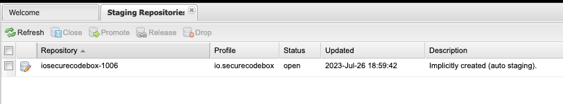
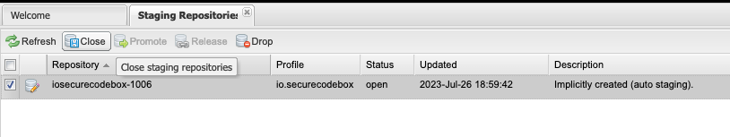
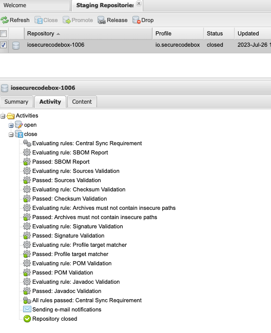

# Release Documentation

Here we describe all the ceremonial stuff necessary to publish a Java library to [Maven Central](https://central.sonatype.com/).

## How to Perform a Release

The release process consists of two main tasks:

1. Build the release on GitHub
2. Release the published artifacts on Maven Central.

### Build the Release on GitHub

1. Go to the [release page](https://github.com/secureCodeBox/defectdojo-client-java/releases) and click "Draft a new release".
2. Create a tag for the release (e.g. "1.0.0", for testing you can add a pre-release identifier like "1.0.0-alpha").
   1. Click "Choose tag".
   2. Type in tag name (e.g. "1.0.0").
   3. Click "Create new tag..."
3. Click "Generate release notes"
4. Select either 
    - "Set as a pre-release" if you have a pre-release identifier in the version (e.g. "1.0.0-alpha").
    - or else "Set as the latest release"
5. Click "Publish release"

### Release the published artifacts on Maven Central.

Hint: You need to hit the "Refresh" button from time to ime, to see changes.

1. Login to the [Nexus Repository Manager](https://oss.sonatype.org/).
2. On the left site navigate to "Staging Repositories"
3. You will see an entry for each unpublished release (usually there is only one):<br>

4. Select the release (in the "Content" tab you can verify the files contained in the release):<br>   

5. Close the repository (this triggers the validation of [requirements][ossrh-requirements]):<br>

6. You can see if all validation rules passed in the "Activity" tab:<br>

7. Then either click "Release" or "Drop":
   - Release: This will publish and sync the artifact to Maven Central. (This can't be undone, there is no way to delete a published artifact!). After syncing the staging repo is dropped automatically.
   - Drop: Does not publish the artifact. Use this if something is broken and ypu want to publish a new release with the same version.
8. After some time (see below) you can find it on Maven Central: <https://central.sonatype.com/artifact/io.securecodebox/defectdojo-client/>

After the first release a [bot created the Maven Central sync][ossrh-jira-issue]:

> Central sync is activated for io.securecodebox. After you successfully release, your component will be available to the public on Central https://repo1.maven.org/maven2/, typically within 30 minutes, though updates to https://search.maven.org can take up to four hours.

## Credentials

Publishing to Maven Central requires authentication in the form of username and password or user token (as username and password). We use [user tokens][user-token] for authentication, which are stored in our password manager.

### Local (on device)

The `MAVEN_USERNAME` and `MAVEN_PASSWORD` environment variable needs to be set on the device.

### GitHub Actions

In the [GitHub Secrets][gh-secrets], we need to add two secrets called `MAVEN_USERNAME` and `MAVEN_PASSWORD`. They can be accessed in a yaml file with `${{ secrets.MAVEN_USERNAME }}` and `${{ secrets.MAVEN_PASSWORD }}`. We pass both these secrets in the `env` block.

For example:

```yaml
- name: Publish to Maven Central
  run: ./gradlew publish
  env:
    MAVEN_USERNAME: ${{ secrets.MAVEN_USERNAME }}
    MAVEN_PASSWORD: ${{ secrets.MAVEN_PASSWORD }}
```

## GPG Guide for Maven Signing

This guide is based on [Working with PGP Signatures][pgp-signatures] and [OpenPGP Best Practices][pgp-best-practices].

### About our key

Real name: `the secureCodeBox authors`
Email: `securecodebox@iteratec.com`
Comment: `Maven Release Signing Key`
Fingerprint: `40AA7D29EB6DE0667D7E723ADE4725604A739BAF`
Password: [see our password manager]

### Create a new key

We create a new GPG key with:

```shell
gpg --full-generate-key
```

### Import the private key

Download private key from password manager and import it locally:

```shell
gpg --import private.key
```

### Export the Private Key

#### For GitHub Actions

```shell
gpg --armor --export-secret-keys $KEYID
```

In the [GitHub Secrets][gh-secrets], add the output of this command to the `SIGNING_KEY` secret.
Additionally, you must add the corresponding password as `SIGNING_PASSWORD`. Both can be accessed in a YAML file with `${{ secrets.SIGNING_KEY }}` and `${{ secrets.SIGNING_PASSWORD }}`. We pass both these secrets in the `env` block.

For example:

```yaml
- name: Publish to Maven Central
  run: ./gradlew publish
  env:
    SIGNING_KEY: ${{ secrets.SIGNING_KEY }}
    SIGNING_PASSWORD: ${{ secrets.SIGNING_PASSWORD }}
```

#### For Password Manager

```shell
gpg -o private.key --export-secret-key $KEYID
```

### Expiration

It is recommended to use an expiration date less than two years. We use an interval of **two years**. This means that we need to extend the expiration date every two years! We use an appointment of the secureCodeBox team calendar to remind us.

#### How to extend the expiration date?

1. Download the private key file `private.key` from password manager
2. Import it locally:  `gpg --import private.key`
3. Select the key : `gpg --edit-key $KEYID`
4. Now select the subkey and set the expiry date (use `2y` for two years):
```shell
gpg> key 1
gpg> expire
```
5. Save it:
```shell
gpg>  save
```
6. Update the private key in out password manager and GitHub Secrets

[gh-secrets]:           https://www.theserverside.com/blog/Coffee-Talk-Java-News-Stories-and-Opinions/GitHub-Actions-Secrets-Example-Token-Tutorial
[user-token]:           https://help.sonatype.com/iqserver/managing/user-management/user-tokens
[pgp-signatures]:       https://central.sonatype.org/publish/requirements/gpg/
[pgp-best-practices]:   https://riseup.net/ru/security/message-security/openpgp/gpg-best-practices
[ossrh-jira-issue]:     https://issues.sonatype.org/browse/OSSRH-40107
[ossrh-requirements]:   https://central.sonatype.org/publish/requirements/#supply-javadoc-and-sources
