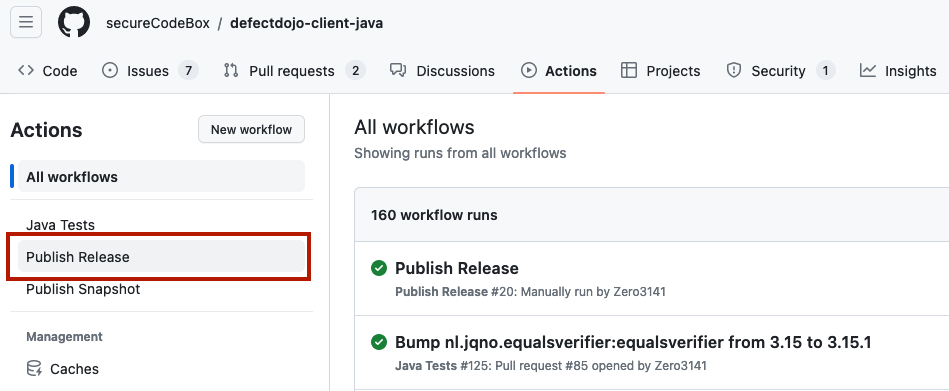
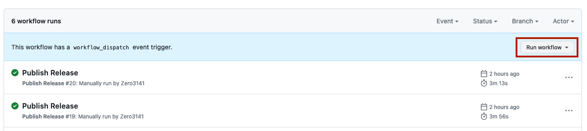
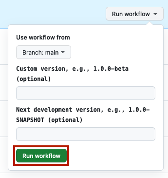
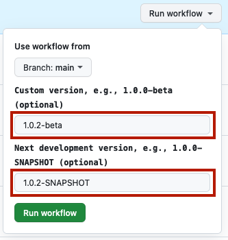

# Release Documentation

Here we describe all the ceremonial stuff necessary to publish a Java library to [Maven Central](https://central.sonatype.com/).

## How to Perform a Release

The whole release process is automated by a [GitHub action workflow](https://github.com/secureCodeBox/defectdojo-client-java/actions) which utilizes the [Maven Plugin](https://central.sonatype.org/publish/publish-portal-maven/). Since we need the possibility to set custom versions (e.g. 2.0.0-beta) we can not use a simple one-push-button solution. Instead, we utilize en event triggered workflow to achieve this. The release process is as following:  

First go to the "Actions" tab and select the "Publish Release" workflow:



Then click the "Run workflow" button:



For an ordinary release simply click the green "Run workflow" button and leave the optional text input fields blank:



Now a "Publish Release" workflow run should appear in the list of runs:


## Custom Release Version

Typically, a release by Maven simply means:

- Remove the "-SNAPSHOT" qualifier from the version in the `pom.xml`. E.g. "1.0.0-SNAPSHOT" will become "1.0.0".
- Build everything, make a commit with this version and tag this version.
- Upload the resulting artifacts to [Maven Central](https://central.sonatype.com/) and stage them.
- Increment to next development version in `pom.xml`. In this example "1.0.1-SNAPSHOT".
- Build everything and make a commit.

In the case you want to publish a custom release, e.g. a "1.0.2-beta", it is necessary to pass it to Maven. For this purpose we introduced the two optional text inputs:

1. _Custom version_: Here you add the version with a custom qualifier. E.g. for the development version "1.0.2-SNAPSHOT" and a beta release, it is "1.0.2-beta".
2. _Next development version_: Since Maven simply increments the last number of the semantic version and appends "-SNAPSHOT", automatic increment is not sufficient here because it will end in something like "1.0.2-beta-SNAPSHOT". So you must specify the next development version by hand. In this example still "1.0.2-SNAPSHOT". 



## Credentials

Publishing to Maven Central requires authentication in the form of username and password or user token (as username and password). We use [user tokens](https://central.sonatype.org/publish/generate-portal-token/) for authentication, which are stored in our password manager.

### Local (on device)

The `MAVEN_USERNAME` and `MAVEN_PASSWORD` environment variable needs to be set on the device.

### GitHub Actions

In the [GitHub Secrets][gh-secrets], we need to add two secrets called `MAVEN_USERNAME` and `MAVEN_PASSWORD`. They can be accessed in a yaml file with `${{ secrets.MAVEN_USERNAME }}` and `${{ secrets.MAVEN_PASSWORD }}`. We pass both these secrets in the `env` block.

For example:

```yaml
- name: Publish to Maven Central
  run: ./gradlew publish
  env:
    MAVEN_USERNAME: ${{ secrets.MAVEN_USERNAME }}
    MAVEN_PASSWORD: ${{ secrets.MAVEN_PASSWORD }}
```

## GPG Guide for Maven Signing

This guide is based on [Working with PGP Signatures][pgp-signatures] and [OpenPGP Best Practices][pgp-best-practices].

### About our key

Real name: `the secureCodeBox authors`
Email: `securecodebox@iteratec.com`
Comment: `Maven Release Signing Key`
Fingerprint: `40AA7D29EB6DE0667D7E723ADE4725604A739BAF`
Password: [see our password manager]

### Create a new key

We create a new GPG key with:

```shell
gpg --full-generate-key
```

### Import the private key

Download private key from password manager and import it locally:

```shell
gpg --import private.key
```

### Export the Private Key

#### For GitHub Actions

```shell
gpg --armor --export-secret-keys $KEYID
```

In the [GitHub Secrets][gh-secrets], add the output of this command to the `SIGNING_KEY` secret.
Additionally, you must add the corresponding password as `SIGNING_PASSWORD`. Both can be accessed in a YAML file with `${{ secrets.SIGNING_KEY }}` and `${{ secrets.SIGNING_PASSWORD }}`. We pass both these secrets in the `env` block.

For example:

```yaml
- name: Publish to Maven Central
  run: ./gradlew publish
  env:
    SIGNING_KEY: ${{ secrets.SIGNING_KEY }}
    SIGNING_PASSWORD: ${{ secrets.SIGNING_PASSWORD }}
```

#### For Password Manager

```shell
gpg -o private.key --export-secret-key $KEYID
```

### Expiration

It is recommended to use an expiration date less than two years. We use an interval of **two years**. This means that we need to extend the expiration date every two years! We use an appointment of the secureCodeBox team calendar to remind us.

#### How to extend the expiration date?

1. Download the private key file `private.key` from password manager
2. Import it locally:  `gpg --import private.key`
3. Select the key : `gpg --edit-key $KEYID`
4. Now set the expiry date (use `2y` for two years):
```shell
gpg> expire
```
5. Save it:
```shell
gpg>  save
```
6. Update the private key in our password manager and GitHub Secrets

[gh-secrets]:           https://www.theserverside.com/blog/Coffee-Talk-Java-News-Stories-and-Opinions/GitHub-Actions-Secrets-Example-Token-Tutorial
[user-token]:           https://help.sonatype.com/iqserver/managing/user-management/user-tokens
[pgp-signatures]:       https://central.sonatype.org/publish/requirements/gpg/
[pgp-best-practices]:   https://riseup.net/ru/security/message-security/openpgp/gpg-best-practices
[ossrh-jira-issue]:     https://issues.sonatype.org/browse/OSSRH-40107
[ossrh-requirements]:   https://central.sonatype.org/publish/requirements/#supply-javadoc-and-sources
